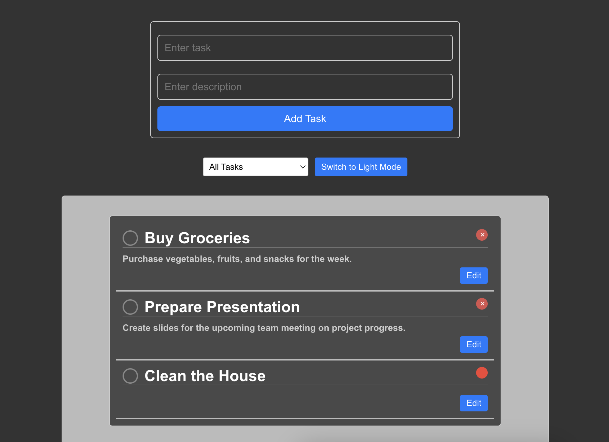

# Personal Task Manager

## Overwie

A simple task manager application built with React. This app allows users to manage their tasks effectively by adding, editing, deleting, and toggling the completion status of tasks. 

## Features

- Add and edit tasks with optional descriptions.
- Delete tasks.
- Toggle completion status of tasks.
- Filter tasks by all, completed, or non-completed.
- Light and dark mode support.
- Tasks are stored in local storage for persistence.

## Deployment

This application is live and accessible at: [https://tymoteuszmilek.github.io/task-manager-app/](https://tymoteuszmilek.github.io/task-manager-app/)

## License

This project is open-source and available under the MIT License.
